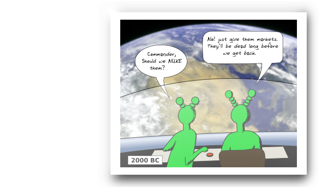

## *Participatory Economy Network*

When capitalism is killing the planet and central planning does´nt seem very tempting, one might look for other ways to do economy. One such way is the participatory economy invented by *Michael Albert* and *Robin Hahnel* called  “Parecon”. Pen wants to take it even further, from the realms of theory into practical implementation. Combining blockchain technology with the radical ideas of participatory economics.

  

 

There is a half baked <a href="docs/White_paper.pdf">white paper</a>

